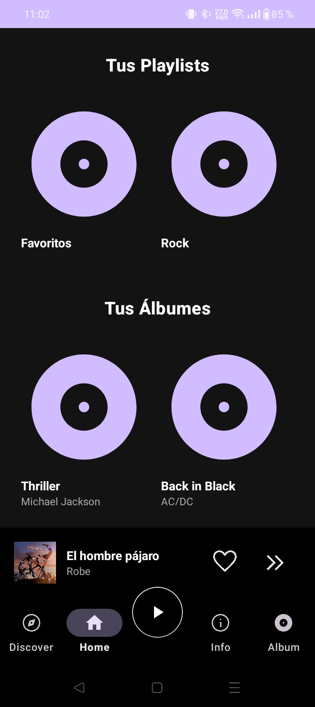
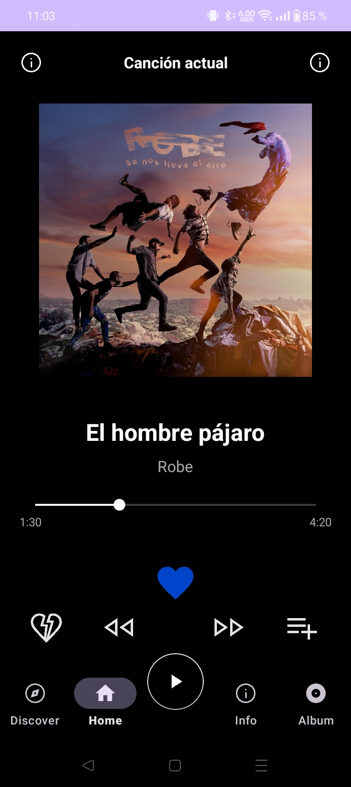

<h1 align="center">SoundWave</h1>

Una mockup para aprender AndroidStudio inspirado en Spotify

<h2>📌 Descripción del proyecto</h2>

Un proyecto creado durante inicios de mi aprendizaje de AndroidStudio para entender y utilizar correctamente la herramienta. No esta terminado.

---

<h2>🖥️ Capturas de la aplicación</h2>

<h3>Landing page</h3>

<h3>Detalle de canciones</h3>

---

<h2>🚀 Tecnologías utilizadas</h2>

<ul>
  <li>Java</li>
  <li>XML</li>
  <li>Android Studio</li>
</ul>

---

<h2>📌 Notas adicionales</h2>

Proyecto NO terminado. No debe tener ninguna funcionalidad adicional, fue creado únicamente para aprender sobre XML y AndroidStudio, un diseño sin nada por detrás

